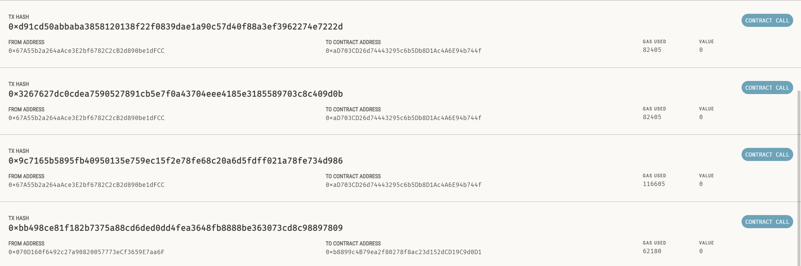

# ZJU-blockchain-course-2024-lab2

## 功能描述

- 用户申请新的房屋NFT
- 用户可以查看自己拥有的房屋NFT
- 用户可以对自己的未挂单的房屋进行挂单
- 用户可使用ERC20代币购买对他人拥有的、已挂单的房屋
- 用户可通过ETH兑换ERC20代币、ERC20代币兑换ETH
- 通过自动做市商算法维护一个无限流通性的交易市场
- 交易者可以对市场进行流通性注入

## 代码结构

### 前端

前端：通过单个页面完成，将不同的功能区放入不同的Card中显示。

### 后端：通过三个合约完成。

- `BuyMyRoom.sol`：主要完成了用户购买、查看房屋NFT的功能与逻辑，继承自ERC721，维护了房屋信息、交易手续费等信息

- `MyERC20.sol`：主要实现了一个自定义的ERC20代币，可以支持铸造、销毁代币、转账等ERC20的主要功能。

- **`Trade.sol`(bonus)**：主要实现了一个恒定乘积自动做市商的算法。此算法可以保持市场的流通性，防止ERC20失去流通性。
    - 可以添加流通性，铸造LP份额$\sqrt{\Delta x \Delta y}$（首次）、$\Delta L = L \cdot \min\{\frac{\Delta x}{x},\frac{\Delta y}{y}\}$（非首次）
    - （暂未实现移除流动性、因为此系统主要功能与此不相关）
    - 交易（用ETH换ERC20、用ERC20换ETH），$\Delta y = - \frac{\Delta x y}{x + \Delta x}$


## 运行方法（本地ganache环境）

1. 克隆仓库`git clone `

2. 在ganache中新建本地区块链网络（端口设置为7545）。

3. 将某个用户的私钥粘贴到`hardhat.config.ts`的`accounts`中。

4. 配置后端环境执行如下命令

    ```shell
    cd contracts
    npm install
    npx hardhat compile
    npx hardhat run scripts/deploy.ts --network ganache
    ```

    `npx hardhat compile`将得到如下输出：

    ```
    Generating typings for: 1 artifacts in dir: typechain-types for target: ethers-v5
    Successfully generated 32 typings!
    Compiled 1 Solidity file successfully (evm target: paris).
    ```

    `npx hardhat run scripts/deploy.ts --network ganache`将得到如下输出：

    ```
    BuyMyRoom deployed to 0x040076aB59398f25DAbAC2b63558aD5D5574502d
    Points deployed to 0x6061880d71dcdb3E9959a28d1D6FD59ee28E6a93
    Trade deployed to 0x7c81f0812E7205084d6FCf08885C382E76678b74
    ```

5. 将得到的这三个地址粘贴到前端的`contract-addresses.json`中。

6. 将Metamask连接到`http://localhost:7545`中，导入用户私钥

7. 在浏览器中打开`http://localhost:7545`

## 代币购买

合约创建者最初拥有一定量ERC20代币，可以将其注入到交易市场中。


交易者可以在交易市场中购买ERC20代币，遵从其合约算法。可以查询汇率


交易者可以兑换代币，兑换代币后汇率更新（需手动获取）。

交易者也可以用代币兑换ETH。

兑换后汇率、余额更新。

用户大量购买ERC20代币

Ganache上对应变化

## 房屋购买

每个用户可以免费创建一些房屋NFT，并通过点击`查看我的房子`来获取全部的房屋信息。


用户可以点击`挂出`挂牌出售房屋，交易合约会收取一定量的手续费。


用户点击`购买`可以购买房子


所有权完成转移


对应用户收到相应数量代币（扣除手续费后，由于手续费查询和交易不完全同时，手续费估算可能存在部分误差）


## 相关Genecha网络上打包的交易截图




